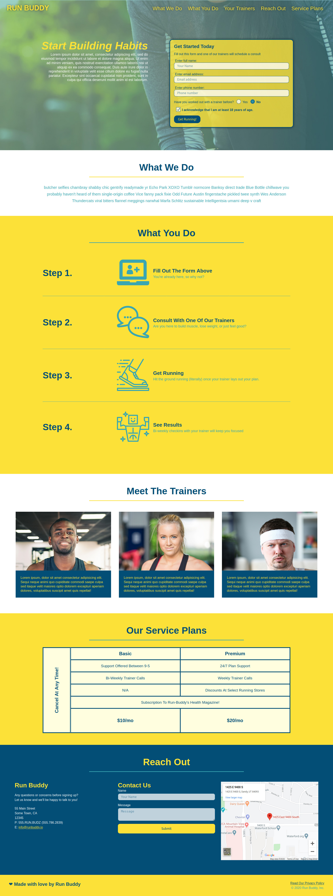

#### Run Buddy

Responsive concept page in pure HTML/CSS.

- [x] [Updates for Hero Section](https://github.com/MBrassey/run-buddy/issues/6)
- [x] [Contact Form for Reach Out Section](https://github.com/MBrassey/run-buddy/issues/7)
- [x] [Advanced layouts using Flexbox](https://github.com/MBrassey/run-buddy/issues/8)
- [x] [Mobile responsiveness with Media Queries](https://github.com/MBrassey/run-buddy/issues/9) 
- [x] [Pricing table using Grid](https://github.com/MBrassey/run-buddy/issues/10)
- [x] [CSS enhancements and optimizations](https://github.com/MBrassey/run-buddy/issues/11)
- [x] [Adding animation](https://github.com/MBrassey/run-buddy/issues/12)
- [x] [Additional responsiveness](https://github.com/MBrassey/run-buddy/issues/20)

<h6>
:cyclone: Click the image(s) below to view the live <a id="Screenshots" href="https://MBrassey.github.io/run-buddy/">webapplication</a>
</h6>

[
](https://MBrassey.github.io/run-buddy/)

#### Questions
Contact me at [matt@brassey.io](mailto:matt@brassey.io) with any questions or comments.

#### License
`Run-Buddy` is published under the __CC0_1.0_Universal__ license.

> The Creative Commons CC0 Public Domain Dedication waives copyright interest in a work you've created and dedicates it to the world-wide public domain. Use CC0 to opt out of copyright entirely and ensure your work has the widest reach. As with the Unlicense and typical software licenses, CC0 disclaims warranties. CC0 is very similar to the Unlicense.